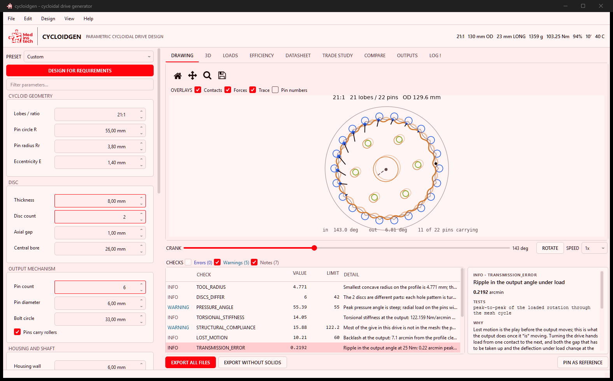
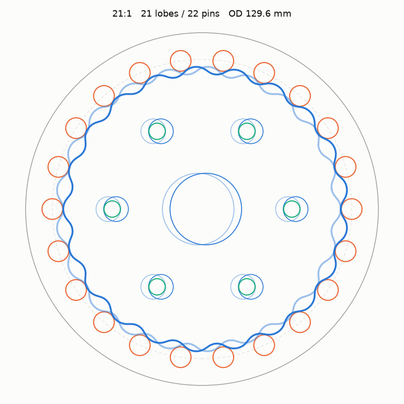
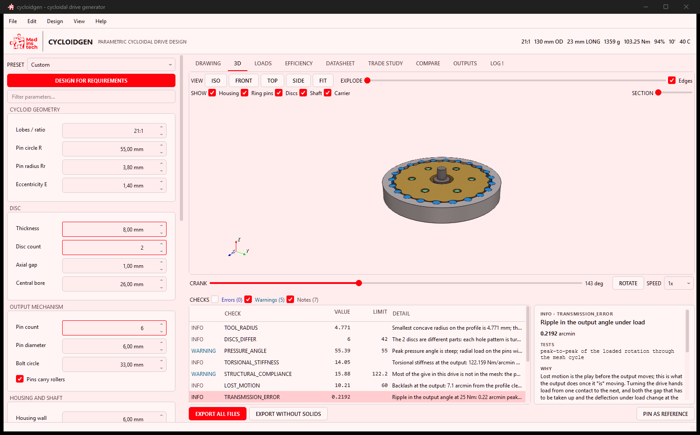
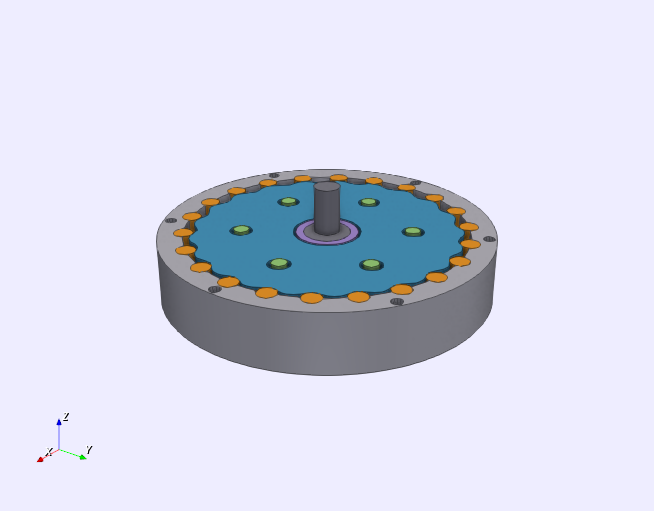
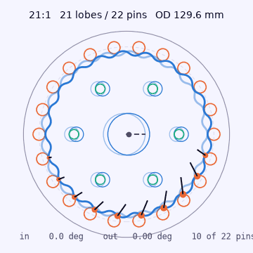
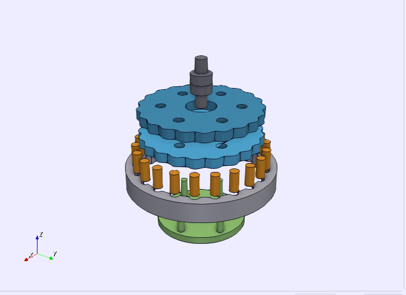
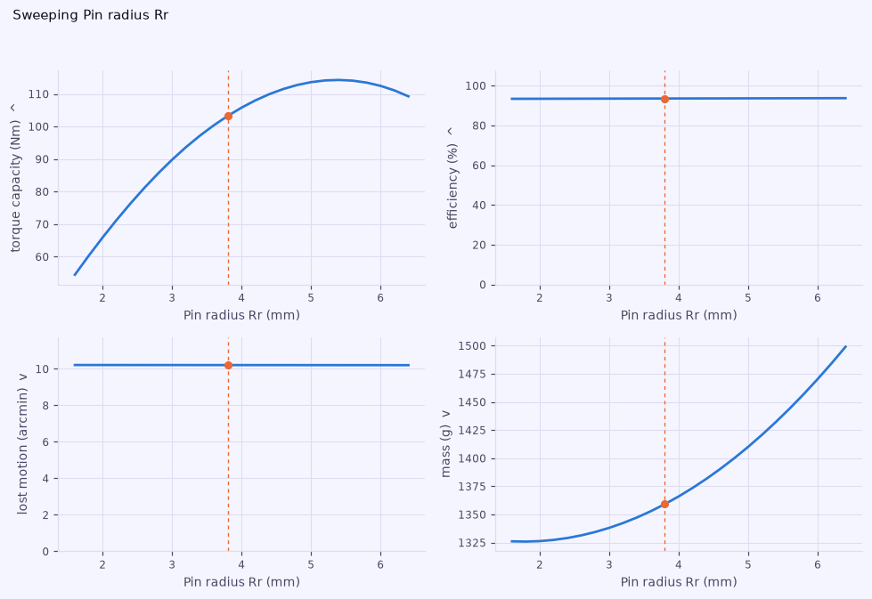

# cycloidgen

[](https://github.com/medinstech/cycloidgen/actions/workflows/tests.yml)
[](LICENSE)
[](pyproject.toml)

Parametric cycloidal drive (cycloidal gearbox) generator: a desktop app that
takes a handful of parameters — or a set of requirements — runs the drive live in
2D and 3D, checks it, sizes it, and writes DXF, SVG, STEP, STL, a looping
animation, a bill of materials and a PDF dossier.

- **Exact geometry.** The conjugate profile in closed form, verified to sit at
  exactly the pin radius from the pin-centre locus — envelope deviation 0.0 µm.
- **A datasheet, not a drawing.** Contact stress, torque capacity, efficiency,
  torsional stiffness, lost motion, transmission error, PV and running
  temperature, mass and inertia, bearing life.
- **Forty-four checks that explain themselves.** Each says what it tests, what
  goes wrong physically when it fails, and which parameter to move — and lights
  that parameter up in the panel.
- **Requirements in, geometry out.** Say ratio, torque, speed and envelope; get
  a shortlist that passes every check, with the trade-offs side by side.
- **Nothing is asserted that is not verified.** 464 tests, and where two parts
  of the app describe the same gearbox they are checked against each other —
  the 3D mesh against the volume the exported solid encloses, the export
  manifest against the files that land on disk.

**Preliminary sizing numbers, not a certification.** See
[*How far to trust the analysis*](#how-far-to-trust-the-analysis).

**Jump to** — [Run it](#run-it) · [Two ways to use it](#two-ways-to-use-it) ·
[What it produces](#what-it-produces) · [The geometry](#the-geometry) ·
[What it tells you](#what-it-tells-you) · [Checks](#checks) ·
[In the app](#in-the-app) · [Tests](#tests) · [Performance](#performance) ·
[Contributing](#contributing)



Selecting a check tells you what it tests, why it matters and what to change;
the parameters it names light up in the panel on the left.



The drawing is a simulation, not an outline. The dots are where the disc touches
each ring pin and the arrows are the load it carries there, both off the same
kinematics the checks and the datasheet use; the faint wavy ring is the path one
point on the disc rim travels over a full output revolution. Twenty-one turns of
the input, one of the output.





The 3D view turns on the same crank as the drawing, so the mechanism is the same
mechanism in both. It is built from the same closed-form profile — not
tessellated from the exported solids — so it works in a build without the CAD
kernel and cannot drift from what you get in the STEP file.

## Run it

Python 3.10 – 3.12, on Windows, Linux or macOS.

```powershell
py -3.12 -m venv .venv                          # Windows
.venv\Scripts\python -m pip install -e ".[dev]"
.venv\Scripts\python -m cycloidgen
```

```bash
python3 -m venv .venv                           # Linux, macOS
.venv/bin/python -m pip install -e ".[dev]"
.venv/bin/python -m cycloidgen
```

Windows also has a [standalone installer](#standalone-build-and-installer) that
needs no Python at all. It is unsigned, so SmartScreen will want a *More info ▸
Run anyway* — see [RELEASING.md](RELEASING.md).

Headless, without opening the window:

```bash
python -m cycloidgen --ratio 29 --out ./my_gearbox
python -m cycloidgen --design saved.json --out ./x --no-solids
```

Or state what you need and let it find the geometry:

```bash
python -m cycloidgen --optimise --ratio 29 --torque 20 --rpm 1500 \
    --max-od 120 --process "CNC machined" \
    --disc-material "Steel 4140 (hardened)" --rollers --out ./x
```

## Two ways to use it

**Give it a design.** Set the twenty-odd parameters and the app tells you what
is wrong with them — this is the original mode and everything below still
applies to it.

**Give it requirements.** Ratio, torque, speed, envelope, process, materials, and
what to optimise for; the search returns a shortlist of geometries that pass
every check, with the trade-offs side by side. `Ctrl+R` in the app, or
`--optimise` on the command line.

Nine free dimensions is too many to grid, so most of them are *derived* from the
relationships good cycloidal geometry actually obeys — eccentricity from the
shortening coefficient, pin radius from the undercut limit, bore from the shaft,
bolt circle as a fraction of the band that is genuinely available. What is left
is six continuous knobs and two discrete ones, screened in closed form before
anything expensive runs. A search that finds nothing reports *why*: `1,400 of
1,500 candidates were over your diameter limit` is a usable answer, an empty
list is not.

## What it produces

Four groups, chosen together or separately — in the app's **Outputs** tab, on
the command line with `--only`, or with the two quick export buttons.

| File | Group | Contents |
|---|---|---|
| `disc.dxf` | drawings | Drawing of the whole drive: disc profile as a closed LWPOLYLINE sampled to the chord tolerance, plus bore, output holes, ring pins and housing, on separate layers |
| `disc.svg` | drawings | Same drawing, 1 unit = 1 mm |
| `dxf/` | drawings | One cutting file per part — each disc on its own, the ring plate, and a carrier drilling template drilled for the *press fit*, not for the disc's running hole |
| `assembly.step` | solids | Full gearbox: housing, ring pins, phased discs, eccentric shaft, output flange, coloured |
| `step/` | solids | Each part as its own solid, in its own frame |
| `stl/` | solids | Each part separately — STL has no assembly structure. A multi-disc stack gets `disc_1.stl`, `disc_2.stl`, … because **the discs are not the same part** (see below) |
| `bom.csv` | data | Every part: quantity, material, size, mass, make or buy, and the bearing designations the sizing study picked |
| `report.json` | data | Every parameter, derived value, load, stiffness, temperature, mass and finding as plain data |
| `report.pdf` | data | Drawing and 3D view, geometry, checks, contact stress, stiffness and backlash, PV and temperature, mass, bill of materials, bearings, and an exploded build order |
| `motion.gif` | animation | The drive turning, looping, with contacts and contact forces — for a document, a chat or an issue. See below for why it loops without a jump |

The **Outputs** tab lists all of that for the current design *before* anything is
written — every file by name, what it is for, and where it will land — then
fills in the sizes afterwards and opens any of them on a double-click. The same
list is available headlessly:

```bash
python -m cycloidgen --ratio 29 --list-outputs
python -m cycloidgen --ratio 29 --only drawings,data --out ./x
```

That list is not a second copy of the truth. `cycloidgen/export/manifest.py`
declares every deliverable once; `write_bundle`, the Outputs tab and
`--list-outputs` all read it, and a test compares the declaration against the
files that actually appear on disk — including this table.

**Why the animation loops without a jump.** A GIF restarts whether or not the
mechanism is back where it started, and one that is not reads as a fault in the
drive rather than in the file. Different parts close at different times. The
disc, the ring contacts and the force arrows close after a *single* input turn —
one turn walks the disc on by exactly one lobe pitch, and a profile with `N`
lobes is unchanged by that rotation. The output carrier does not: it advances
`360/N` per input turn and repeats every `360/output_pin_count`, so it needs
`N / gcd(N, output_pin_count)` turns — five for the 15:1 preset, seven for the
21:1, fifty-nine for the 59:1. When the exact period does not fit the frame
budget the answer is *not* as many turns as will fit: any whole turn leaves the
disc closed, so the run to choose is the one whose carrier lands closest to a
hole pitch, and at 29:1 that is five turns (2.1° out) rather than ten (4.1°).

Making that true of the pixels rather than only of the arithmetic took two
fixes, both of which are improvements in their own right. The chord-tolerance
sample count is now rounded up onto a whole number of samples per lobe, so the
sampled polygon has the disc's own symmetry instead of sampling each lobe from a
slightly different place. And the disc outline is drawn as a closed path rather
than a polyline with its first point repeated, so its seam is a join like any
other — a seam travels round the rim as the disc turns, and it was changing a
handful of pixels every frame at a place where nothing was happening.

## The geometry

With `R` the ring-pin circle radius, `Rr` the pin radius, `E` the eccentricity,
`N` the lobe count, `Np = N+1` pins and `K1 = E*Np/R`:

```
D(t) = sqrt(1 + K1² − 2·K1·cos(N·t))
x(t) =  R·cos(t) − E·cos(Np·t) − Rr·(cos(t) − K1·cos(Np·t)) / D(t)
y(t) = −R·sin(t) + E·sin(Np·t) + Rr·(sin(t) − K1·sin(Np·t)) / D(t)
```

The reduction is the lobe count, `i = N = Np − 1`, and the output pin holes are
the pin diameter plus twice the eccentricity.

> **Sign warning.** The equivalent `psi` formulation needs a *leading minus*:
> `psi(t) = -atan2(sin(N·t), R/(E·Np) - cos(N·t))`. The positive-sign variant is
> widespread online and is wrong - it deviates by millimetres and the disc
> interferes with the pins by about 1 mm, which seizes the drive. `tests/test_profile.py`
> pins both the correct form and the trap.

Everything above is verified numerically rather than trusted:

- **Envelope property** - every profile point sits exactly `Rr` from the
  pin-centre locus (deviation 0.0000 µm). This is what makes the disc roll
  instead of dig in.
- **Meshing sweep** - a full input revolution runs with under 2 µm residual
  interference, while a ratio one tooth away jams by 450-730 µm. That proves the
  profile and the motion law together.
- **Undercut limit** - `Rr < 1/max(-kappa)` of the locus. The locus curvature
  collapses to `(A + B·u)/(C − D·u)^1.5` with `u = cos(N·t)`, so the extreme is a
  closed-form root rather than a 40 000-point scan — which is what makes the
  design search affordable. Cross-checked against the brute-force result.
- **Assembly fit** - every output pin stays inside its hole through a full
  revolution, on every disc; the disc clears the housing bore.

## Clearance: which way the offset goes

Both clearance levers have to *shrink* the disc. It reaches `R − Rr + E` from its
own centre, so growing the generating roller (`equidistant`) and shrinking the
generating pin circle (`pin_circle`) each pull the profile inward. Two of the
three modes originally had the pin-circle sign backwards and cut a ~200 µm
*interference* instead of a clearance; `both` cancelled itself out to almost
exactly zero. Nothing noticed, because every other test ran on the default mode.

So the clearance is no longer assumed — it is **measured**, as the distance from
each pin centre to the manufactured profile less the pin radius
(`core.kinematics.mesh_gaps`). `PROFILE_INTERFERENCE` is an error and
`CLEARANCE_NOT_DELIVERED` a warning, and every mode is tested to open a real gap.

That measured gap then feeds the load model, which answers the question the old
`README` could only flag as a limitation:

- an **equidistant** offset gives every pin the same normal gap, so a contact
  only comes into mesh once the disc has turned far enough to close it. Contacts
  with a short moment arm need much more rotation than the long ones — so at low
  torque a handful of pins carry everything, and the peak force is several times
  the ideal share. Capacity is derated accordingly.
- more torque pulls more pins in; a tighter process pulls more pins in. Both are
  visible in the datasheet as *pins carrying load*, and both are tested.

## Multi-disc stacks: the discs are different parts

A disc sitting on crank phase `p` has to rotate by `p/N` to stay meshed with the
ring. But every disc is coupled to the *same* output carrier, so every disc must
also share the carrier's rotation. Both can only hold if each disc's output-hole
pattern is turned back against its lobes by `-p/N`.

So in a two-disc drive the second disc is the first one with its holes moved half
a lobe pitch. They are **not interchangeable** — swapping them jams the drive.
They would only be identical with `2*N` output pins, which is normally far too
many, and the app tells you (`DISCS_DIFFER`) when that is not the case. The
per-part files, the STLs and the bill of materials all keep them apart.

This was wrong in the first version and is now pinned by `tests/test_assembly.py`.
The visible symptom is worth knowing: in the drawing, the green output pin must
stay inside its blue hole at every crank angle. When it pokes out, the hole
pattern is at the wrong angle.

## What it tells you

Beyond the geometry checks, every design gets a datasheet:

- **Torque capacity**, both on the ideal load share and derated for what
  clearance actually does to it.
- **Torsional stiffness** in Nm/arcmin and **lost motion** in arcmin, from
  Hertzian line-contact springs (Johnson's elastic approach) on the ring and
  output stages, in series with the parts they are mounted in — the ring pin
  seats, the carrier pins in bending, the carrier plate, the disc body, the
  housing barrel and the input shaft. Every one of those is reported on its own
  line, because "everything else" as a single number is a number to distrust,
  and because on most designs the softest part is a surprise. On a printed drive
  the two halves are comparable, which already costs the answer a third. The
  better the mesh, the worse the imbalance: a ground steel drive stiffens its
  contacts by two orders of magnitude and its cantilevered carrier pins by
  nothing at all, and ends up an order of magnitude softer than its own mesh.
- **Transmission error** — the ripple in output angle under a steady load, which
  is the number that decides whether a drive can *position*. Lost motion is the
  play before the output moves; this is what it does once it is moving, as the
  mesh hands load from one contact to the next. Each stage is swept over its own
  period, and they are not the same: the output stage repeats every
  `2·pi·N/(n·(N−1))` of crank, about two and a half lobe pitches, and measuring
  it over a lobe pitch instead reports about half the ripple that is there.
  A phased disc stack cancels much of it — the discs ride opposite halves of the
  same cycle — which a stiffness average cannot see, because phasing leaves the
  mean alone and only moves the ripple.
- **What your tolerance costs.** Everything else in the app places the pins
  exactly, and with a uniform clearance that means they all come into mesh
  together. Enter the true position your shop holds and the load sharing is
  solved over a *batch* of rings drawn from that tolerance zone — a single
  number does not say where each pin went, worst case is a ring nobody will
  build, and nominal is a ring nobody has built. Out comes the middle ring and
  the bad one: stiffness, load concentration, lost motion and transmission
  error, each with its tail. Past the point where the tolerance approaches the
  clearance the pins interfere and the drive binds, and the app says so rather
  than quietly reading an interfering pin as a free preload.
- **PV and running temperature.** PV is the wear limit, and it is what actually
  finishes a printed drive — a PLA disc can sit well inside its stress allowable
  and still wear round in an afternoon. Quoted on the projected-area convention
  the published limits use, *not* the Hertzian peak; the two differ by several
  times and are not interchangeable.
- **Mass, inertia, unbalance.** Off the real lobed section, not a cylinder.
  Reflected inertia at the input, and the shaking force a single disc throws —
  which goes as the square of speed. Evenly phased discs cancel the force and
  leave a couple.
- **Disc web stress.** The ligament beside the output holes is the thinnest
  structural member in the drive and nothing else was looking at it.

## Checks

Forty-four of them. Errors block export; warnings do not; several are readings
rather than tests.

**Profile** — `K1_TOO_HIGH` · `K1_HIGH` · `UNDERCUT` · `UNDERCUT_MARGIN` ·
`PROFILE_SELF_INTERSECT` · `PROFILE_INTERFERENCE` · `CLEARANCE_NOT_DELIVERED` ·
`PIN_RADIUS_SUGGESTION`

**Layout** — `PIN_OVERLAP` · `PIN_SPACING` · `HOLE_HITS_BORE` ·
`HOLE_BREAKS_RIM` · `THIN_INNER_WEB` · `THIN_OUTER_WEB` ·
`OUTPUT_HOLES_OVERLAP` · `OUTPUT_HOLE_SPACING` · `ECCENTRIC_TIGHT` ·
`DISCS_DIFFER`

**Manufacturing** — `CLEARANCE_DEFICIT` · `HOLE_CLEARANCE_DEFICIT` ·
`TOOL_RADIUS` · `PIN_POSITION`

**Load and stress** — `PRESSURE_ANGLE` · `HERTZ_STRESS_RING` ·
`HERTZ_STRESS_MARGIN` · `HERTZ_STRESS_OUTPUT` · `LOAD_CONCENTRATION` ·
`WEB_SHEAR` · `WEB_SHEAR_MARGIN`

**Precision** — `TORSIONAL_STIFFNESS` · `STRUCTURAL_COMPLIANCE` ·
`LOST_MOTION` · `TRANSMISSION_ERROR`

**Wear, heat and life** — `LOW_EFFICIENCY` · `PV_LIMIT_RING` · `PV_MARGIN_RING` ·
`PV_LIMIT_OUTPUT` · `OVERTEMP` · `RUNNING_HOT` · `SHORT_BEARING_LIFE` ·
`NO_BEARING_FITS`

**Dynamics and mass** — `SINGLE_DISC_UNBALANCE` · `UNBALANCE_FORCE` · `MASS`

Selecting a check in the app highlights the parameters it is actually about, so
you are not left guessing which of twenty-odd numbers it wants you to change.
That list is not maintained by hand: the codes are parsed out of the calls that
raise them, and a check added without an explanation fails the suite.

`PIN_RADIUS_SUGGESTION` is worth knowing about: the equivalent contact radius
works out to `R_eq = Rr·(1 − Rr/rho_c)`, a parabola peaking at `Rr = rho_c/2`.
Contact stress is therefore lowest at half the critical pin radius, and the app
suggests it.

## In the app

- **Drawing** — the live 2D simulation. A crank slider and playback at a chosen
  speed, and four overlays that can be turned on independently: contact points
  sized by the share of load they carry, contact forces to scale, the traced
  path of a point on the disc rim, and ring pin numbers. Input and output angles
  are read out under the drawing, so the reduction is something you watch rather
  than something you are told. A pinned reference design shows underneath as a
  ghost outline.

  

  Everything drawn comes off `core.kinematics`, the module that was verified
  against a full-revolution meshing simulation — the picture cannot tell a
  different story from the datasheet. Force arrows are scaled against the worst
  force over a whole lobe pitch rather than against the current frame, so an
  arrow that grows means the load grew and not that the scale moved under it.

  That animation is a file the app writes, not a screen recording: seven input
  turns of the 21:1 preset, which is exactly its period.

- **3D** — the assembled drive on the same crank. Drag to orbit, right-drag to
  pan, wheel to zoom, standard viewpoints, an explode slider, per-group
  visibility so you can take the housing off and watch the mesh, and a capped
  section plane — the cut reads as solid material with the cut faces a shade
  darker, not as a hollow casting. Turning **Edges** on draws the part's
  features — rims, hole lips, the join between a cylinder and its end — and not
  the triangulation underneath them.

  

  It renders on the GPU through VTK — which costs no new dependency, because
  the CAD kernel that writes your STEP files already brings it. Depth buffer,
  smooth shading off feature-angle normals so the pins are round rather than
  faceted, a three-point light rig, screen-space ambient occlusion sized off the
  drive so a pin sits *in* its pocket, and multisampled edges. Geometry is
  uploaded once per design; turning the crank sets one transform per part, so a
  frame is bounded by the display's refresh rate and a 59:1 drive with sixty
  pins costs exactly what a 15:1 one does.

  There is a **software fallback** — the same scene, back-face culled and
  painted back to front with `QPainter` — for a build with the kernel stripped
  out, a machine with no OpenGL, or a remote session that will not forward it. A
  flat-shaded gearbox beats a tab that shows an error. It is also what draws the
  3D views in the PDF, where a vector figure is worth more than a screenshot,
  and what makes the projection testable on a machine with no display at all.

  The mesh is verified against the volume of the solid that gets exported, part
  by part, so the picture and the STEP file are the same gearbox.

- **Outputs** — every file an export writes, by name, with what it is for and
  where it will land, *before* anything is written. Sizes fill in afterwards and
  a double-click opens any of them.
- **File ▸ Export animation** (`Ctrl+Shift+E`) writes whichever view you are
  looking at as a looping GIF — the drawing with the overlays you have ticked,
  or the assembly from the angle, explode and part visibility you have set. It
  renders off the GUI thread with a real progress bar and a Cancel that leaves
  no half-written file, and it uses the appearance you are in rather than the
  print surface the bundled `motion.gif` gets.
- **Loads**, **Efficiency**, and a **Datasheet** tab with everything above.
- **Trade study** — sweep any one parameter and watch torque capacity,
  efficiency, lost motion and mass move together, on their own real units, with
  the infeasible band shaded rather than silently dropped.

  

  Read off that chart: pin radius buys torque capacity up to a genuine optimum
  and then gives it back — the `PIN_RADIUS_SUGGESTION` check in closed form —
  while costing mass the whole way and doing essentially nothing for efficiency
  or backlash. Note the flat panels start at zero. A quantity that moves by a
  tenth of a percent gets an axis that says so, rather than one scaled to make
  the noise look like a decision.
- **Compare** — pin a design, change things, and see exactly what moved and by
  how much. Running the optimiser pins the design it replaced automatically.
- **Appearance** follows the desktop and can be overridden per user
  (View ▸ Appearance). Both palettes are contrast-tested rather than asserted,
  and chrome and figures switch together — a chart on a white slab inside a dark
  window is the thing following the desktop theme was meant to prevent. The
  light mode is tinted paper, mixed from the brand's own blue, rather than
  white; the PDF still prints on white, because a tint on every figure is ink
  someone pays for and gains nothing on paper.

  Structure is drawn rather than implied by shadow, and the brand blue is spent
  only where it means *this one* — the primary action, the focused field, the
  selected row and tab, a ticked box. It used to be on every group heading, tab
  and rule as well, and at that point it stops being emphasis.
- **Checks filter** — severity toggles carrying their own counts, because a
  design routinely produces a dozen findings of which ten are notes and the two
  that block an export sit somewhere in the middle.
- **Units** (View ▸ Units) — millimetres or decimal inches, for everything you
  *read*: the parameter fields, the datasheet, the checks list, the comparison
  table and the drawing's own title. Everything you *hand over* stays
  millimetres — DXF, STEP, STL, the JSON report and the PDF — because a CAD file
  whose units follow a preference is a CAD file nobody can trust. Internally the
  design is millimetres and never leaves them: a switch reloads the widgets from
  the spec rather than converting what is in them, so toggling the menu twenty
  times cannot move a number.
- **Explain this check** — select a finding and the panel beside it says what
  the check tests (the relation, in the notation above), what goes wrong
  physically when it fails, what to change and in which direction, and how many
  times clear of the limit you are. The parameters it names are highlighted in
  the panel at the same time. `cycloidgen/core/explain.py` declares one
  explanation per check code; a test parses the source for the calls that raise
  codes, so a check cannot be added without one or left behind when it goes.
- **Log** — everything the app would otherwise print to a terminal you do not
  have. Checks as they appear and clear, searches with their shortlists, sweeps,
  exports, plus every Python warning, stray stderr write, and any exception that
  escapes a worker thread. Timestamped, level-filtered, copyable. The tab marks
  itself when something arrives while you are looking elsewhere. It earned its
  keep immediately: the first run surfaced a `RuntimeWarning` from a negative
  log term in the contact-stiffness solver that had been silently producing NaNs
  on degenerate geometry.
- Undo/redo, recent files, a parameter filter box, and the session reopens on
  the design, tab, crank angle and panel split you left. The split is stored as
  a *proportion*: remembering pixels hands a narrower screen most of its width
  to the parameter panel. The analysis runs off the GUI thread with generation
  numbering, so a slow result can never overwrite a newer one.

Preferences live wherever the platform puts them, or in a file of your choosing
via `CYCLOIDGEN_SETTINGS` — which is what makes a portable install possible, and
what lets the test suite run without rearranging your actual application.

## How far to trust the analysis

The ideal load model treats the disc as rigid and each contact as a linear
spring, so force is proportional to moment arm and only the pushing half of the
pins carries load — the classical Kudryavtsev/Lehmann assumption. The stiffness
model *does* see clearance and is what the capacity derating comes from, and it
counts the parts around the mesh rather than calling them rigid — but it counts
them as ideal parts. Joints, fits and fasteners are not in it, so a real drive
measures softer again, and two of the six terms rest on an assumption the
geometry does not settle (see `analysis/compliance.py`, which states both).
Pin position error is modelled only if you enter a tolerance; with none entered
the ring is perfect, which no ring is. Transmission error is the
drive's own share only — clearance take-up and deflection, both of which it
solves; pin position error, profile error and runout are the manufacturing half
and are not modelled, so a real drive measures worse. The thermal model is a single
lumped body in still air with no conduction into whatever the gearbox is bolted
to. Bearing catalogue values are nominal metric-series figures. PV limits are
dry-against-steel design-guide values.

**These are preliminary sizing numbers, not a certification.** Calibrate against
a physical prototype before committing to a design.

## Layout

```
cycloidgen/
├── units.py    what lengths are *shown* in; everything inside is millimetres
├── core/       spec (the one source of truth), profile, kinematics, validate,
│               explain (what each check tests, why, and what to change)
├── analysis/   mechanics (Hertz), stiffness (contacts, backlash, transmission
│               error), compliance (the parts around the mesh, as springs),
│               tolerance (where the pins actually are), thermal, mass,
│               efficiency, bearings
├── design/     optimise (requirements -> geometry), sweep (trade studies)
├── viz/        3D geometry and rendering maths, no Qt: mesh, scene (the
│               software projection), vtkbridge (mesh -> VTK polydata)
├── export/     manifest (what a bundle contains), dxf, svg, solid (OCCT),
│               bom, animation (the looping GIF)
├── report/     plots (shared by UI and PDF), build
└── ui/         PySide6 window, 3D viewer, outputs tab, declarative field table,
                optimiser dialog, trade-study tab, undo/redo history, log panel,
                branding (palette and stylesheet), plotbar (the trimmed
                matplotlib toolbar)
tests/          464 tests; the envelope, pin-in-hole, clearance-sign,
                mesh-versus-solid and animation-closes tests matter most
```

Two boundaries in there are load-bearing. **`core` and `viz` do not import Qt**,
which is what lets the geometry and the renderer be tested without a display and
what keeps one piece of code drawing both the window and the PDF. And
**`export/manifest.py` declares every output file exactly once** — the writer,
the Outputs tab, `--list-outputs` and the table above all read it.

## Tests

```bash
.venv\Scripts\python -m pytest -q
```

464 tests, about 315 s. Most of that is CadQuery writing solids; the pure
analysis tests run in a few seconds. The Qt tests run headless
(`QT_QPA_PLATFORM=offscreen`, set by the test modules themselves) and redirect
preferences into a temporary file, so the suite cannot rearrange your own
application.

Two of them are worth calling out because they are the ones that keep separate
representations of the same gearbox honest:

- **The 3D mesh against the exported solid.** Every part's mesh volume is
  computed by the divergence theorem and compared against what OCCT says the
  STEP body encloses, to within faceting error. The same test checks that each
  part is a *closed* surface — the vector areas of its faces must cancel
  exactly, which catches a missing end cap, a wall built for the wrong number of
  edges, or a loop wound the wrong way round. It has already earned its keep: it
  found the eccentric shaft double-counting the barrel inside its own cams.
- **The manifest against the disk.** An export is compared against what the
  manifest promised — exactly those files and no others — including the table in
  this README.

CI runs `ruff`, then the suite on Linux, Windows and macOS across the oldest and
newest supported Python, then separately exports a full bundle and runs a design search
from the command line — the tests cover the pieces, that job proves the whole
thing still runs end to end.

Lint rules live in `pyproject.toml` so they mean the same thing locally and in
CI. `ruff format` is deliberately not part of it: the repository has a
hand-aligned style the formatter would rewrite wholesale, and a lint that hunts
bug shapes is worth more than one that enforces a preference.

The README figures come out of the same plotting code the app and the PDF use,
so they cannot drift from what it actually draws:

```bash
.venv\Scripts\python docs\make_figures.py
```

The two screenshots of the window are taken by a second script, and it needs a
real desktop session rather than the offscreen platform the tests use — twice
over. Offscreen Qt has no fonts, so every label renders as tofu; and the 3D
tab's viewport is a native OpenGL surface that `QWidget.grab` composites *around*,
leaving a black hole where the gearbox was. So the window is opened, driven —
hero design, overlays on, a check selected, the camera set — and photographed
through `PrintWindow` with `PW_RENDERFULLCONTENT`, which asks Windows for the
window's own rendering including native children and does not care what is
stacked on top of it:

```powershell
.venv\Scripts\python tools\make_screenshots.py
```

## Performance

A full re-analysis is about 110 ms — every check, every load, the stiffness
model, transmission error and the whole datasheet, on each parameter edit. It
was 106 ms when it did a fraction of that work, and three things bought the room
the rest of it went into: the mesh sweep is computed once and shared instead of
three modules each running their own, the profile, the undercut limit and the
measured mesh clearances are cached, and the self-intersection test uses a
uniform-grid broad phase instead of sampling every other segment against all the
rest — which was also skipping over crossings it should have caught.

Entering a pin position tolerance is the one thing that costs real time, about
half a second, because it stops analysing *a* gearbox and starts analysing a
batch of them. It is off unless you ask for it.

Animation runs on a 33 ms tick and both views fit inside it. The drawing costs
about 10 ms a frame, down from 25: the artists are built when the *design*
changes and repositioned when the *angle* does, so a crank move no longer
rebuilds a couple of hundred patches and re-runs `tight_layout`. The 3D view
sets seven transforms and hands them to the card, so it is bounded by vsync
rather than by us; the software fallback does the whole projection in numpy in
about 1 ms and spends the rest painting, for roughly 13 ms a frame.

Neither view is redrawn while its tab is hidden — a hidden matplotlib canvas
will still honour `draw_idle` with a full render, which is ten milliseconds a
frame spent on something nobody can see — and neither rebuilds geometry for a
change that did not touch it. The mesh cache is keyed on the fields the geometry
actually depends on, so changing a material or the rated torque does not send a
fresh copy of the assembly to the graphics card. That key is a hand-written list
and therefore a liability, so a test perturbs *every* field of `GearSpec` in turn
and requires that an unchanged key really does mean an unchanged mesh.

The live animation loops over the mechanism's own period, which is `lobes`
input revolutions — one output revolution — and not one turn of the crank. After
a single input turn the disc and the carrier have moved on by 360/lobes and are
not back where they started, which is what used to put a visible jump in the
loop every four seconds. The *exported* animation cannot afford that many turns
at a legible frame rate and picks its run differently — see **Why the animation
loops without a jump** above.

## Standalone build and installer

```powershell
.\packaging\release.ps1                        # lint, tests, bundle, installer
.\packaging\release.ps1 -FastPack -SkipTests    # quick internal build
```

Or the two steps by hand:

```bash
.venv\Scripts\python -m PyInstaller cycloidgen.spec --noconfirm
dist\cycloidgen\cycloidgen.exe                         # the window
dist\cycloidgen\cycloidgen-cli.exe --list-outputs      # the command line
makensis /INPUTCHARSET UTF8 packaging\cycloidgen.nsi   # needs NSIS 3.x
```

The bundle carries **two executables over one analysis**, which is the
`pythonw.exe` / `python.exe` arrangement and for the same reason.
`cycloidgen.exe` is windowed — it is what the shortcuts point at, and a console
build there put a black window behind the application every time somebody opened
it from the Start menu. `cycloidgen-cli.exe` is the console one, for headless
runs. A single windowed build would have taken the command line away and taken
it away badly: a frozen windowed process has no stdout at all, so `--version`
would not print nothing, it would raise.

The installer upgrades in place — it clears the previous version first, because
unpacking a PyInstaller bundle *over* another one leaves modules and DLLs from
the old version that load in preference to the new ones and then fail in ways
that look like an application bug. It waits if the application is running,
registers properly with Add/Remove Programs, and leaves your preferences and
last design alone when uninstalled. English and Turkish.

Versions come from one line in `cycloidgen/__init__.py`: the wheel, the About
box, the executable's file properties, the installer's filename and the release
workflow all read that one, and `tests/test_version.py` fails if a second copy
appears or if the changelog has no section for it. See
[RELEASING.md](RELEASING.md).

Verified working, GUI and CLI, including STEP/STL export. Two things about the
PyInstaller spec are load-bearing and easy to break:

- The entry point is `launcher.py`, not `cycloidgen/__main__.py`. PyInstaller
  runs its entry script as a top-level module, which breaks relative imports.
- `_casadi.pyd` (pulled in by CadQuery's assembly solver) gets relocated to the
  bundle root while the DLLs it links against stay in `casadi/`, so the spec
  copies those DLLs to the root as well. Without it the exe dies with
  `DLL load failed while importing _casadi`.

The bundle is about 1.2 GB, essentially all OCCT. If that matters, build with
`--no-solids` in mind: the drawings-and-report path does not need CadQuery, and
dropping `cadquery`, `OCP`, `casadi` and `vtkmodules` from the spec cuts the
bundle to a fraction of the size.

## Where it is going

One thing is worth more than everything else on the list: **calibration against
real hardware**. Every number here is a first-principles estimate with a stated
model and stated limits. That is honest, and it is also the ceiling — the moment
there is a table of predicted versus measured, this stops being a calculator and
becomes a calibrated instrument.

After that, in rough order: fatigue rather than only static strength, since the
disc web and the pins see a fully reversed cycle every input revolution; a
lubrication regime, because one fixed friction coefficient is carrying
efficiency, PV and temperature between them; bearing life under combined load
and misalignment; and more kinds of drive — compound and multi-stage, RV-type,
a pinwheel output. On the output side, dimensioned drawing sheets with
tolerances and a title block, which is what a shop actually wants; 3MF with
per-part colour; STEP AP242 with PMI. [Open an issue](../../issues) if one of
those is what stands between you and using it — that moves it up the list.

## Contributing

[CONTRIBUTING.md](CONTRIBUTING.md) covers setup, the house style, the settled
questions, and what a change looks like here. The short version: numbers are
verified rather than asserted, comments say *why*, and `ruff format` is
deliberately not part of the build.

The most valuable contribution needs no code at all — **build one of these and
measure it**.

Also: [CHANGELOG.md](CHANGELOG.md) · [RELEASING.md](RELEASING.md) ·
[SECURITY.md](SECURITY.md) · [CODE_OF_CONDUCT.md](CODE_OF_CONDUCT.md)

## License

Apache-2.0. Copyright 2026 Medinstech. See [LICENSE](LICENSE).

The Medinstech name and logos under `cycloidgen/ui/assets/` are trademarks and
are **not** covered by that licence — see [NOTICE](NOTICE). They load through a
single module (`cycloidgen/ui/branding.py`) so that replacing them in a fork is
one obvious change.

The numbers this produces are preliminary sizing estimates, not a certification —
see *How far to trust the analysis* above. Apache-2.0 disclaims warranty for a
reason, and that disclaimer is meant literally here: validate against a physical
prototype before anything load-bearing depends on it.
